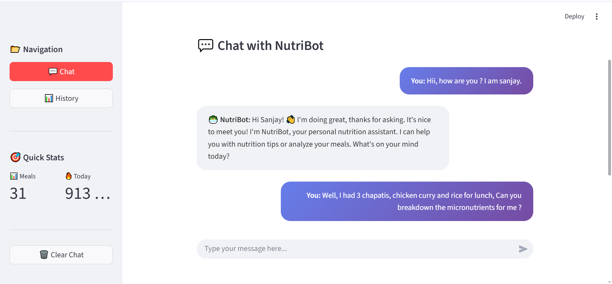
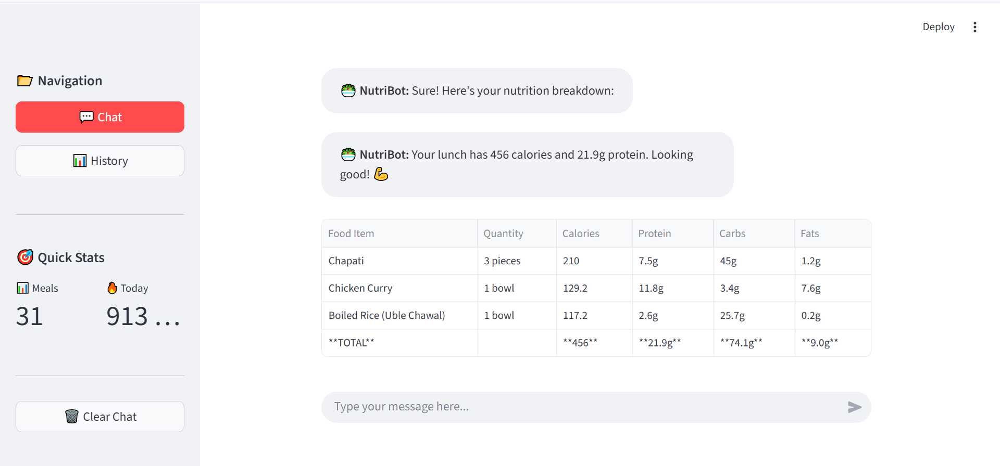
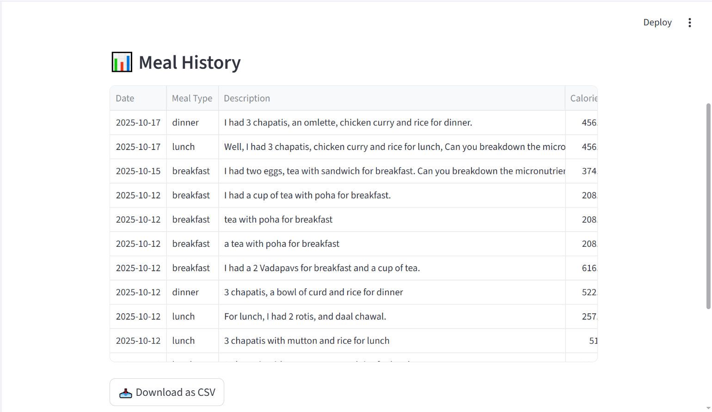

# 🥗 Nutrition Chatbot

An intelligent chatbot that analyzes meal descriptions and provides detailed nutritional information including calories, proteins, carbs, fats, and fiber.

## 🌟 Features

- **Natural Language Processing**: Understands casual meal descriptions using Google Gemini AI
- **Indian Food Focus**: Comprehensive database of common Indian foods
- **Detailed Nutrition Breakdown**: Calories, protein, carbs, fats, and fiber per meal
- **Flexible Input**: Handles various ways of describing food and quantities
- **Interactive UI**: User-friendly interface using steamlit


### Step 1: Install Dependencies

```bash
# Create virtual environment (recommended)
python -m venv venv

# Activate virtual environment On Windows:
venv\Scripts\activate

# Install required packages
pip install -r requirements.txt
```

### Step 2: Configure Environment Variables

1. Create a `.env` (if not already there) file in the root directory
2. Add your Gemini API key:

```
GEMINI_API_KEY=your_actual_api_key_here
```


## 🎯 Usage

### Interactive Mode

Run the chatbot in interactive mode:

```bash
python app.py
```

Then type your meals naturally:

```
💬 You: I had 2 chapatis, 1 bowl of rice, daal and bhindi for lunch
```

## 📊 Example Output







## 🍛 Available Foods

The database currently includes around 1000 common Indian foods:
- Chapati/Roti/Phulka
- Rice (White/Plain)
- Daal/Lentils
- Bhindi (Okra)
- Paneer
- Chicken Curry
- Aloo Sabzi
- Curd/Yogurt
- Paratha
- Egg
- Idli
- Dosa
- Sambar
- Rajma
- Milk

You can easily add more foods by editing `data/nutrition_db.json`.

## 🛠️ Adding New Foods

To add new foods to the database, edit `data/nutrition_db.json`:

```json
{
  "id": 16,
  "name": "food_name",
  "aliases": ["alternative_name1", "alternative_name2"],
  "serving_size": "1 serving description",
  "serving_size_grams": 100,
  "calories": 150,
  "protein": 5,
  "carbs": 25,
  "fats": 3,
  "fiber": 2
}
```

**Made with ❤️ for healthier eating habits**